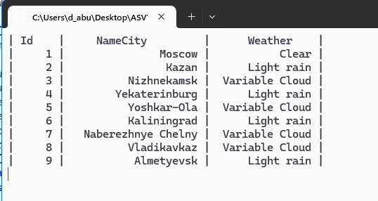

# Приложение для симуляции погоды 🌤️🌧️

**Приложение для симуляции погоды** — это .NET-приложение, демонстрирующее асинхронное взаимодействие клиента и сервера через TCP и симуляцию обновления погодных условий для различных городов.

Проект использует `NetTcpClient` для подключения к серверу, управления данными пользователей и динамического назначения погодных условий.

## Основные возможности 🚀

- **Клиент-серверное взаимодействие**: Устанавливает TCP-соединение для работы с сервером.
- **Управление пользователями**: Получение и обновление информации о пользователях.
- **Симуляция погоды**: Случайное назначение погодных условий для городов.
- **Асинхронные операции**: Использование async/await для выполнения неблокирующих вызовов.
- **Консольный интерфейс**: Отображение обновлений в режиме реального времени.

## Обзор кода 📂

### Главная программа

Точка входа инициализирует TCP-клиент и подключается к серверу по адресу `tcp://127.0.0.1:5555`. Затем вызывается метод `ManageUsers`, который управляет данными пользователей и симулирует погодные условия.

```csharp
public static async Task Main(string[] args)
{
    var serverAdress = new Uri("tcp://127.0.0.1:5555");
    var client = new NetTcpClient(serverAdress);
    Console.WriteLine($"Connect to server at {serverAdress}");
    await client.ConnectAsync();

    var userApi = new UserApiClient(client);
    await ManageUsers(userApi);
    client.Dispose();
}
```

### Логика симуляции погоды

Метод `ManageUsers`:
- Получает список пользователей с сервера.
- Назначает случайные погодные условия из заранее определённого массива.
- Обновляет и отображает статус погоды для пользователя в реальном времени.

```csharp
string[] weatherArray = { "Cloudy", "Clear", "Variable Cloud", "Rain", "Light rain" };
Random random = new Random();

int CityStatus = random.Next(1, 10);
int CityStatus11 = random.Next(1, 7);

var addUser = new User(
    Id: user1.Id,
    Name: user1?.Name,
    Active: weatherArray[CityStatus11]
);
var addResult = await userApi.UpdateAsync(CityStatus, addUser);
```

### Вывод в консоль

В консоли отображается таблица с данными пользователей: идентификатор, название города и погодный статус.

```plaintext
| Id  | NameCity           | Weather          |
| 1   | New York           | Cloudy           |
| 2   | Los Angeles        | Clear            |
```

## Требования 🛠️

- [SDK .NET 6](https://dotnet.microsoft.com/download/dotnet/6.0)
- Работающий TCP-сервер, совместимый с реализацией `NetTcpClient`.

## Скриншоты
