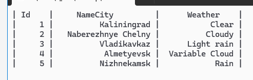
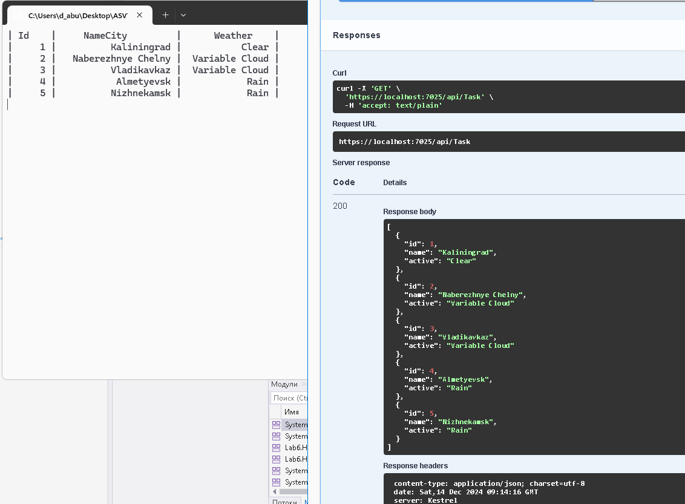

# Лабораторная работа на тему "HTTP"

## Обзор

Этот проект представляет собой простое консольное приложение, которое взаимодействует с API управления задачами для отображения и обновления статусов погоды для различных городов. Приложение извлекает задачи из API, отображает их в формате таблицы и случайным образом обновляет погодный статус выбранного города.

## Возможности

- **Получение задач**: Извлекает все задачи из API и отображает их в табличном формате.
- **Случайное обновление погоды**: Случайным образом выбирает город и обновляет его погодный статус из заранее определенного списка.
- **Консольный интерфейс**: Предоставляет простой интерфейс для взаимодействия через консоль.

## Требования

- .NET SDK (версии 6.0 или выше)
- Доступ к работающему экземпляру API по адресу `http://localhost:5214/api/`

### Структура кода

- **Program.cs**: Содержит основную точку входа в приложение и управляет извлечением и обновлением задач.
- **TaskApiClient.cs**: (Предполагается, что является частью `Lab6.Http.Common`) Обрабатывает HTTP-запросы для взаимодействия с API управления задачами.
- **TaskItem.cs**: Представляет элемент задачи с такими свойствами, как `Id`, `Name` и `Active`.

### Как это работает

1. Приложение инициализирует `HttpClient`, указывая на базовый адрес API.
2. Оно входит в бесконечный цикл, где:
   - Извлекает все задачи из API.
   - Отображает их в формате таблицы.
   - Случайным образом выбирает город и обновляет его погодный статус с использованием данных из заранее определенного массива.
3. Цикл приостанавливается на 5 секунд между итерациями, чтобы позволить наблюдать за изменениями.

### Пример вывода

```
| Id    |     Название города   |      Погода      |
|  1    | Нью-Йорк             |      Облачно     |
|  2    | Лос-Анджелес         |      Ясно       |
|  3    | Чикаго               |      Дождь      |
...

## Описание класса `TaskApiClient`

Класс `TaskApiClient` реализует интерфейс `ITaskApi` и предоставляет методы для взаимодействия с API управления задачами. Он использует `HttpClient` для выполнения HTTP-запросов к API. Ниже приведены описания основных методов этого класса:

### Конструктор

```csharp
public TaskApiClient(HttpClient httpClient)
```
- **Параметры**:
  - `httpClient`: Экземпляр `HttpClient`, используемый для отправки запросов к API.
- **Описание**: Инициализирует новый экземпляр класса `TaskApiClient`, устанавливая базовый клиент для выполнения HTTP-запросов.

### Методы

#### `AddAsync(TaskItem newTask)`

```csharp
public async Task<bool> AddAsync(TaskItem newTask)
```
- **Параметры**:
  - `newTask`: Новый элемент задачи, который необходимо добавить.
- **Возвращаемое значение**: Возвращает `true`, если задача была успешно добавлена, иначе — `false`.
- **Описание**: Отправляет POST-запрос к API для добавления новой задачи. 

#### `DeleteAsync(int id)`

```csharp
public async Task<bool> DeleteAsync(int id)
```
- **Параметры**:
  - `id`: Идентификатор задачи, которую необходимо удалить.
- **Возвращаемое значение**: Возвращает `true`, если задача была успешно удалена, иначе — `false`.
- **Описание**: Отправляет DELETE-запрос к API для удаления задачи по заданному идентификатору.

#### `GetAllAsync()`

```csharp
public async Task<TaskItem[]> GetAllAsync()
```
- **Возвращаемое значение**: Возвращает массив всех задач (`TaskItem[]`). Если задачи не найдены, возвращает пустой массив.
- **Описание**: Отправляет GET-запрос к API для получения всех задач и возвращает их в виде массива.

#### `GetAsync(int id)`

```csharp
public async Task<TaskItem?> GetAsync(int id)
```
- **Параметры**:
  - `id`: Идентификатор задачи, которую необходимо получить.
- **Возвращаемое значение**: Возвращает объект `TaskItem`, если задача найдена; в противном случае — `null`.
- **Описание**: Отправляет GET-запрос к API для получения конкретной задачи по заданному идентификатору. В случае ошибки возвращает `null`.

#### `UpdateAsync(int id, TaskItem updateTask)`

```csharp
public async Task<bool> UpdateAsync(int id, TaskItem updateTask)
```
- **Параметры**:
  - `id`: Идентификатор задачи, которую необходимо обновить.
  - `updateTask`: Объект с новыми данными для обновления существующей задачи.
- **Возвращаемое значение**: Возвращает `true`, если задача была успешно обновлена, иначе — `false`.
- **Описание**: Отправляет PUT-запрос к API для обновления существующей задачи по заданному идентификатору.

## Заключение

Класс `TaskApiClient` обеспечивает удобный интерфейс для работы с API управления задачами, позволяя выполнять основные операции CRUD (создание, чтение, обновление и удаление) с задачами.


## Работа программы


