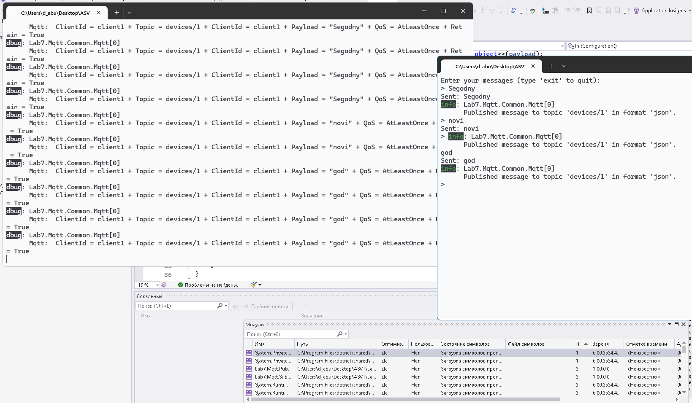

# Лабораторная работа на тему "Сетевые приложения. MQTT сервер-клиент"
## Цель

Разработка клиент-серверных приложений на языке программирования C# с использованием протокола MQTT 
и брокера сообщений MQTT.

Пример приложений:

* MQTT-брокер, можно использовать любой, например Mosquitto 
* MQTT-подписчик: подключается к MQTT-брокеру, слушает топик на входящие с сообщения-телеметрию
* MQTT-издатель: подключается к MQTT-брокеру, публикует сообщения-телеметрию в топик

## Задача

Модифицировать приложения MQTT издателя и  подписчика, чтобы приложение издателя
MQTT отправляло ваше сообщение в любом формате, а подписчик мог принять и декодировать.


MQTT приложения (подписчик, издатель и брокер):

```
+--------------+   публикация      +--------------+   подписка        +---------------+
| MQTT-издатель|------------------>| MQTT-брокер  |<------------------| MQTT-подписчик|
+--------------+  топик: /dev1/msg +--------------+ топик: /dev1/#    +---------------+
                   
```

## Структура кода

### Структура кода MQTT Publisher

Код состоит из одного основного класса `Program`, который выполняет следующие функции:

1. **Инициализация сервисов**:
   - Создание контейнера зависимостей с использованием `ServiceCollection`.
   - Добавление кэша в память и логирования.

2. **Загрузка конфигурации**:
   - Чтение настроек из файла `appsettings.json`.

3. **Создание экземпляра MQTT**:
   - Инициализация класса `Common.Mqtt` с использованием загруженных настроек и логгера.

4. **Публикация сообщений**:
   - Метод `StartPublishAsync` позволяет пользователю вводить сообщения для отправки на заданную тему до тех пор, пока не будет введено слово 'exit'.

Пример структуры класса:
```csharp
class Program {
    private static IMemoryCache memoryCache;
    private static IConfiguration configuration;
    private static ServiceProvider serviceProvider;
    private static MqttConnectionSettings MqttConnectionSettings;

    static async Task Main(string[] args) {
        // Инициализация сервисов, конфигурации и MQTT.
    }

    private static async Task StartPublishAsync(Common.Mqtt mqttSender) {
        // Логика публикации сообщений.
    }

    private static IConfiguration InitConfiguration() {
        // Загрузка конфигурации из файла.
    }
}
```

### Структура кода MQTT Subscriber

Код состоит из одного основного класса `Program`, который выполняет следующие задачи:

1. **Инициализация сервисов**:
   - Создание контейнера зависимостей с использованием `ServiceCollection`.
   - Добавление кэша в память и логирования.

2. **Загрузка конфигурации**:
   - Чтение настроек из файла `appsettings.json`, включая параметры подключения к MQTT-брокеру.

3. **Создание экземпляра MQTT**:
   - Инициализация класса `Common.Mqtt` с использованием загруженных настроек и логгера.
   - Подписка на события получения сообщений через делегат `OnReceive`.

4. **Подписка на темы**:
   - Метод `SubscribeAsync` отвечает за подписку на заданную тему с указанным уровнем качества обслуживания (QoS).

5. **Обработка полученных сообщений**:
   - Метод `Handler` принимает сообщения, определяет их формат (JSON или текст) и выводит соответствующую информацию в лог.

### Пример конфигурации
Файл `appsettings.json` должен содержать настройки подключения к MQTT-брокеру и тему для подписки. Пример конфигурации:

```json
{
  "Mqtt": {
    "Broker": "mqtt://broker.hivemq.com",
    "Port": 1883,
    "ClientId": "ВашClientId",
    "QOS": 1
  },
  "Topic": "ваш/топик"
}
```
# Пример работы:


